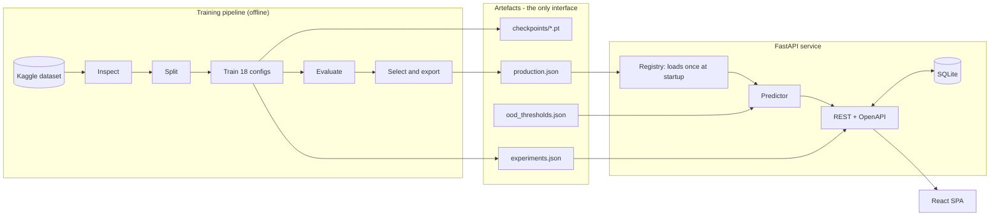
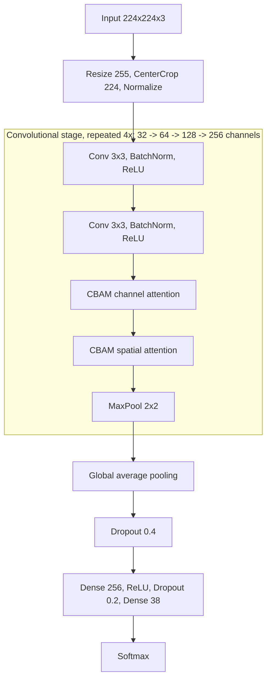

# PlantGuard AI — Plant Disease Detection Using CNN with Attention Mechanism

Detect plant diseases from leaf images using a convolutional neural network with
a **Convolutional Block Attention Module (CBAM)**, with calibrated confidence,
visual explanations of every decision, and an explicit refusal to answer when the
image does not warrant one.

```
Upload  →  quality gate  →  preprocess  →  CNN + CBAM  →  calibrated confidence
        →  out-of-distribution check  →  Grad-CAM / attention  →  disease guidance
```

---

## Contents

- [What this is](#what-this-is)
- [Problem statement](#problem-statement)
- [Objectives](#objectives)
- [Features](#features)
- [Results](#results)
- [Architecture](#architecture)
- [Technology stack](#technology-stack)
- [Dataset](#dataset)
- [The proposed model: CNN + CBAM](#the-proposed-model-cnn--cbam)
- [Training methodology](#training-methodology)
- [Explainable AI](#explainable-ai)
- [Confidence and out-of-distribution handling](#confidence-and-out-of-distribution-handling)
- [Installation](#installation)
- [Reproducing the results](#reproducing-the-results)
- [Running the application](#running-the-application)
- [API reference](#api-reference)
- [Project structure](#project-structure)
- [Testing](#testing)
- [Deployment](#deployment)
- [Screenshots](#screenshots)
- [Adding more plants or diseases](#adding-more-plants-or-diseases)
- [Limitations](#limitations)
- [Future work](#future-work)
- [Research contribution](#research-contribution)
- [Documentation index](#documentation-index)

---

## What this is

A complete, working system — not a notebook and not a demo:

* a **training pipeline** that discovers the dataset, builds leak-checked splits,
  trains 18 model configurations under one controlled protocol, evaluates them
  and selects a production model on measured merit;
* a **FastAPI service** that loads the exported model once at startup and serves
  predictions with quality gating, calibrated confidence, out-of-distribution
  detection and explainability heat maps;
* a **React dashboard** covering the user journey (upload → diagnosis) and the
  researcher journey (dataset → benchmark → ablation → calibration).

**Every number in this repository is generated.** `docs/results.md`,
`docs/model_comparison.md`, `docs/ablation_study.md` and the results section
below are written by `scripts/generate_docs.py` from the experiment ledger. If
an experiment has not been run, the corresponding section says so instead of
showing a placeholder.

---

## Problem statement

The FAO estimates that plant pests and diseases destroy up to 40% of global
crop production each year. Accurate diagnosis normally requires a trained plant
pathologist, who is unavailable to most smallholder farmers. A smartphone
photograph of a leaf is, by contrast, universally available.

The naive framing — "train a CNN on leaf images" — produces a system that is
confidently wrong on anything it has not seen, offers no reason for its answer,
and reports uncalibrated softmax scores as if they were probabilities. In
agriculture, a confident wrong answer costs a season's crop. This project treats
the classifier as one component of a system that must also know when to abstain
and must be able to justify itself.

---

## Objectives

1. Build a CNN with CBAM attention for multi-class plant disease classification.
2. Benchmark it fairly against classical ML baselines and seven other deep
   architectures under one identical protocol.
3. Quantify, through a controlled ablation, whether channel attention, spatial
   attention, SE and full CBAM each contribute anything.
4. Explain every prediction visually (Grad-CAM, Grad-CAM++, learned attention).
5. Calibrate confidence so a stated percentage means what it says.
6. Detect out-of-distribution and poor-quality inputs and decline to guess.
7. Ship the whole thing as a usable, documented, tested web application.

---

## Features

### For the user

| Feature | Detail |
|---|---|
| Drag-and-drop, browse, or camera capture | Mobile camera opens directly to the rear lens |
| Instant quality pre-check | Runs before analysis; gives specific, actionable fixes |
| Disease + plant identification | 38 classes across 14 plant species |
| Calibrated confidence | Temperature-scaled, banded HIGH / MEDIUM / LOW |
| Top-5 alternatives | With probabilities, so near-misses are visible |
| Four explainability views | Original, Grad-CAM, Grad-CAM++, CBAM attention |
| Reliability panel | Shows the three checks the system ran before answering |
| Disease knowledge base | Symptoms, spread, favourable conditions, prevention, management |
| Prediction history | Search, filter, sort, inspect, delete |
| Dark / light theme | Follows the OS until the user chooses |
| Responsive | Verified at 375 px and desktop widths |

### For the researcher

| Feature | Detail |
|---|---|
| Dataset report | Class counts, imbalance, geometry, corruption, leakage check |
| Benchmark table | Sortable, with size/latency trade-off scatter plots |
| Ablation study | Five arms with deltas against the no-attention control |
| CBAM placement study | Which stages of the network benefit |
| Training curves | Per experiment, with the fine-tuning boundary marked |
| Calibration | Reliability diagrams before and after temperature scaling |
| OOD analysis | Per-score AUROC and whole-pipeline rejection rates |
| Per-class metrics | Hardest classes surfaced first |
| Figure gallery | Every rendered plot and confusion matrix |
| Experiment ledger | Full configuration and hardware for each run |

---

## Results

<!-- RESULTS:START -->
| Result | Model | Protocol | Value |
|---|---|---|---|
| Best accuracy | ResNet50 + CBAM | benchmark | **99.14%** |
| Best macro F1 | ResNet50 + CBAM | benchmark | **0.9914** |
| Fastest inference | Logistic Regression (hand-crafted features) | classical | 0.02 ms/image |
| Smallest model | Ablation A: CNN | ablation | 4.8 MB |
| Best proposed (CBAM) model | EfficientNet-B0 + CBAM | production | 99.00% accuracy, 0.9898 macro F1 |
| Serving in the application | EfficientNet-B0 | production | selected by `f1_macro` |
| Evaluated on | held-out test split | — | 17,572 images, 38 classes |

Rows with different protocols are **not** comparable: `benchmark` models were trained on a fixed subset and scored on a 4,560-image split, `production` models on the full data and scored on 17,572 images.

### Benchmark (identical protocol across all architectures)

Every row below was trained on the same fixed budget and scored on the same held-out subset, so the ranking is meaningful. Absolute numbers are lower than a full-data run would give, by design.

| | Model | Protocol | Accuracy | Precision | Recall | Macro F1 | Top-3 | Params | Size | ms/img | ECE |
|---|---|---|---|---:|---:|---:|---:|---:|---:|---:|---:|
|  | ResNet50 + CBAM | benchmark | 99.14% | 0.9917 | 0.9914 | 0.9914 | 99.96% | 24.11M | 92.2 MB | 15.93 | 0.0612 |
|  | ResNet50 | benchmark | 99.12% | 0.9914 | 0.9912 | 0.9912 | 99.93% | 23.59M | 90.2 MB | 14.19 | 0.0614 |
|  | DenseNet121 | benchmark | 97.81% | 0.9781 | 0.9781 | 0.9780 | 99.78% | 6.99M | 27.0 MB | 33.52 | 0.0617 |
|  | EfficientNet-B0 | benchmark | 97.02% | 0.9707 | 0.9702 | 0.9700 | 99.65% | 4.06M | 15.6 MB | 19.47 | 0.0721 |
| **★** | EfficientNet-B0 + CBAM | benchmark | 96.82% | 0.9688 | 0.9682 | 0.9681 | 99.63% | 4.26M | 16.4 MB | 17.84 | 0.0727 |
| **★** | Custom CNN + CBAM | benchmark | 96.07% | 0.9612 | 0.9607 | 0.9605 | 99.58% | 1.26M | 4.8 MB | 7.39 | 0.0418 |
|  | Custom CNN + SE | benchmark | 96.03% | 0.9609 | 0.9603 | 0.9598 | 99.54% | 1.26M | 4.8 MB | 4.47 | 0.0626 |
|  | Custom CNN (baseline) | benchmark | 95.83% | 0.9586 | 0.9583 | 0.9578 | 99.50% | 1.25M | 4.8 MB | 2.13 | 0.0670 |
|  | MobileNetV3-Large | benchmark | 95.02% | 0.9507 | 0.9502 | 0.9497 | 99.25% | 3.01M | 11.6 MB | 13.64 | 0.0957 |
|  | MobileNetV3-Large + CBAM | benchmark | 94.78% | 0.9480 | 0.9478 | 0.9473 | 99.14% | 3.12M | 12.0 MB | 14.24 | 0.0901 |
|  | XGBoost (hand-crafted features) | classical | 93.07% | 0.9309 | 0.9307 | 0.9302 | 98.86% | — | — | 0.05 | — |
|  | Random Forest (hand-crafted features) | classical | 90.53% | 0.9068 | 0.9053 | 0.9037 | 97.65% | — | — | 0.09 | — |
|  | Linear SVM (hand-crafted features) | classical | 87.96% | 0.8785 | 0.8796 | 0.8778 | 96.01% | — | — | 0.09 | — |
|  | Logistic Regression (hand-crafted features) | classical | 87.24% | 0.8726 | 0.8724 | 0.8719 | 97.15% | — | — | 0.02 | — |

### Full-data production runs

Trained on the complete training split at 224px and scored on the full test split. **These numbers cannot be compared with the benchmark table above** - a different training budget and a different, larger test set. They are what the deployed system actually achieves.

| | Model | Protocol | Accuracy | Precision | Recall | Macro F1 | Top-3 | Params | Size | ms/img | ECE |
|---|---|---|---|---:|---:|---:|---:|---:|---:|---:|---:|
|  | EfficientNet-B0 | production | 99.06% | 0.9906 | 0.9904 | 0.9904 | 99.94% | 4.06M | 15.6 MB | 18.50 | 0.0500 |
| **★** | EfficientNet-B0 + CBAM | production | 99.00% | 0.9900 | 0.9898 | 0.9898 | 99.94% | 4.26M | 16.4 MB | 13.17 | 0.0500 |
| **★** | Custom CNN + CBAM | production | 98.42% | 0.9845 | 0.9842 | 0.9842 | 99.90% | 1.26M | 4.8 MB | 7.41 | 0.0245 |

### Attention ablation

| Arm | Configuration | Accuracy | Macro F1 | Macro recall | Δ Macro F1 | Δ Accuracy | Params | ms/img |
|---|---|---:|---:|---:|---:|---:|---:|---:|
| **A** | CNN (control) | 95.88% | 0.9582 | 0.9588 | — | — | 1,248,774 | 1.92 |
| **B** | CNN + Channel attention | 96.34% | 0.9631 | 0.9634 | +0.49 pt | +0.46 pt | 1,259,782 | 4.22 |
| **C** | CNN + Spatial attention | 96.12% | 0.9606 | 0.9612 | +0.24 pt | +0.24 pt | 1,249,166 | 3.25 |
| **D** | CNN + SE | 96.38% | 0.9634 | 0.9638 | +0.51 pt | +0.50 pt | 1,259,782 | 5.37 |
| **E** | CNN + CBAM | 96.29% | 0.9628 | 0.9629 | +0.45 pt | +0.42 pt | 1,260,174 | 6.66 |
<!-- RESULTS:END -->

Full detail: [`docs/results.md`](docs/results.md) ·
[`docs/model_comparison.md`](docs/model_comparison.md) ·
[`docs/ablation_study.md`](docs/ablation_study.md)

> **On the proposal's 98.6% estimate.** The proposal that seeded this project
> predicted roughly 98.6% accuracy for CNN + CBAM. That number is *not*
> reproduced here, hard-coded or otherwise. The figures above are whatever the
> experiments produced. Benchmark rows come from a deliberately reduced training
> budget (see [Training methodology](#training-methodology)), so they are
> pessimistic by design; production rows use the full training split.

---

## Architecture



The boundary between training and serving is strict: the API process cannot
train, cannot read the dataset, and cannot compute a metric. It reads a
checkpoint and some JSON. That is what makes it impossible for a reported number
to drift from the experiment that produced it.

Details: [`docs/architecture.md`](docs/architecture.md)

---

## Technology stack

| Layer | Choice | Why |
|---|---|---|
| Deep learning | **PyTorch 2.13 + torchvision** | TensorFlow has no GPU support on Windows for Python 3.13 — native-Windows GPU builds stopped at TF 2.10 / Python 3.10. PyTorch CUDA works and was verified on the target GPU. See the note below. |
| Classical ML | scikit-learn, XGBoost | Baselines on hand-crafted features |
| Image processing | Pillow, OpenCV, scikit-image | Decode, quality metrics, LBP/GLCM/HOG |
| API | FastAPI + Uvicorn | Automatic OpenAPI, Pydantic validation at the boundary |
| Database | SQLite + SQLAlchemy | Zero-config; ORM makes PostgreSQL a URL change |
| Frontend | React 19 + Vite + Tailwind CSS 4 | Fast HMR, small bundle |
| Charts | Recharts | Declarative, composes with React state |
| Tracking | JSON + CSV ledger | Runs from a clean clone with no server; the API reads it directly |
| Containers | Docker + nginx | Same-origin proxy, no CORS in production |

> **Framework note.** The proposal specified TensorFlow/Keras. That is not
> viable on the target platform: TensorFlow's native-Windows GPU support ended
> at 2.10, which requires Python ≤ 3.10, and this machine runs Python 3.13. A
> TensorFlow build here would therefore be CPU-only, on a project whose GPU
> sweep already takes hours. All model code is isolated in `backend/app/ml/` and
> shared by training and serving, so a port would touch one directory.

---

## Dataset

[`vipoooool/new-plant-diseases-dataset`](https://www.kaggle.com/datasets/vipoooool/new-plant-diseases-dataset)
— an augmented derivative of PlantVillage.

Nothing about the archive's layout is assumed: `training/dataset_inspect.py`
walks the download, finds the ImageFolder-style splits (which are nested two
directories deep with a duplicated folder name), and derives everything from the
files present.

| Property | Measured |
|---|---|
| Official `train/` | 70,295 images |
| Official `valid/` | 17,572 images |
| Classes | 38 |
| Plant species | 14 |
| Healthy / diseased classes | 12 / 26 |
| Image size | 256 × 256, uniform |
| Corrupt (1,520 sampled) | 0 |
| Imbalance ratio | 1.23 |
| Train↔valid pHash collisions | 0 |

### Split protocol

```
official train/  ──stratified 90/10──►  train 63,265  +  val 7,030
official valid/  ─────────────────────►  test 17,572   (never used for tuning)
```

Validation drives early stopping, learning-rate scheduling, checkpoint selection
and temperature fitting. The test split is touched once per model, after
training completes.

Because the dataset ships pre-augmented, a perceptual-hash check for
train↔test near-duplicates is run and reported. It found none — as a *sampled*
estimate, which is how it is described.

Details: [`docs/methodology.md`](docs/methodology.md)

---

## The proposed model: CNN + CBAM



### CBAM

**Channel attention — *what* matters.** Each feature map is pooled to one number
by *both* average and max pooling; both descriptors pass through a shared
bottleneck MLP, are summed, and a sigmoid produces one gate per channel.
Average pooling captures how extensively a feature appears; max pooling captures
its strongest evidence. A small, intense lesion has a low average and a high
maximum — this is exactly why CBAM's channel branch differs from SE, which uses
average pooling alone.

**Spatial attention — *where* it matters.** The channel axis is collapsed by
average and max pooling into a two-channel map; a single 7×7 convolution and a
sigmoid produce one gate per pixel. The large kernel is deliberate: deciding
lesion-versus-background needs surrounding context.

Both gates multiply the feature map, in that order, and add **under 1%** to the
parameter count.

CBAM sits after the activated, batch-normalised features and *before*
down-sampling, where it has the most spatial detail to work with. Which stages
receive a block is a configurable parameter, and the placement experiment
measures the best choice rather than assuming it.

Conceptual detail: [`docs/concepts.md`](docs/concepts.md)

---

## Training methodology

### The controlled protocol

Training 18 architectures on 63,265 images was not feasible on the available
4 GB GPU. Rather than give each model an arbitrary budget — which would make the
comparison meaningless — **every model in the benchmark, ablation and placement
studies gets an identical budget**:

| | Benchmark protocol | Production protocol |
|---|---|---|
| Train images | 300/class (11,400) | full split (63,265) |
| Validation | 60/class (2,280) | 7,030 |
| Test | 120/class (4,560) | 17,572 |
| Image size | 160 px | 224 px |
| Epochs | 12 | 6 (early stopping, patience 2) |
| Augmentation | light | medium |

Only the architecture changes. The `protocol` column in every table marks which
regime produced each row; the two are never compared as though they were one
experiment.

### Common settings

AdamW · LR 3e-4 · weight decay 1e-4 · 1 warm-up epoch then cosine decay ·
label smoothing 0.05 · gradient clipping at norm 1.0 · early stopping on
validation accuracy · seed 42 everywhere including DataLoader workers.

### Two-stage transfer learning

**Stage 1** freezes the backbone and trains only the head — a random head's
first gradients would otherwise destroy the pretrained features. **Stage 2**
unfreezes the top 3 blocks at 15% of the base learning rate, so semantic layers
adapt while generic edge/texture filters are preserved. The transition is marked
on every training curve.

### Hardware adaptation, measured not assumed

| Adaptation | Reason |
|---|---|
| **AMP disabled** | A startup micro-benchmark measured fp16 at **0.24×** fp32 speed on the GTX 1650 (TU117 has no tensor cores). AMP is enabled only when the measured speed-up exceeds 1.15×. |
| **Per-architecture batch caps** | VRAM ceilings scaled by input area, halved without AMP. A CUDA OOM triggers one automatic retry at half the batch. |
| **Worker budgeting** | Each spawned DataLoader worker reserves ~1 GB of Windows commit charge for torch's CUDA DLLs. Exceeding the limit hangs the run; the count is budgeted against RAM and a spawn failure falls back to in-process loading. |

---

## Explainable AI

| View | What it shows | Honest limitation |
|---|---|---|
| **Grad-CAM** | Regions whose amplification would most raise the predicted class score | Coarse — final feature map is 7×7 or 14×14, upsampled |
| **Grad-CAM++** | Same, weighted so multiple disjoint lesions all contribute | Same resolution limit |
| **CBAM attention** | The spatial gate the network itself learned, read from the forward pass | Not class-specific |
| **Integrated gradients** | Pixel-level attribution satisfying a completeness axiom | Noisy; needs many passes |

The UI states the caveat explicitly rather than burying it:

> Heat maps show where the network pooled evidence for its decision, at the
> resolution of its final feature map. **They are not a disease segmentation**
> and do not measure lesion extent. If the highlighted region sits on the
> background rather than the leaf, treat the prediction with caution.

Two implementation details worth noting: Grad-CAM++ back-propagates the raw
score rather than `exp(score)` (the paper's formulation overflows to `inf` for
large logits — there is a regression test for it), and a CAM whose ReLU erases
everything falls back to magnitude rather than rendering an uninformative black
square.

---

## Confidence and out-of-distribution handling

### Calibration

Softmax outputs are systematically over-confident. **Temperature scaling** fits
one scalar on the *validation* split and divides the logits by it. Because a
positive scalar cannot change which logit is largest, accuracy is provably
unchanged — only confidence moves. Both reliability diagrams (raw and scaled)
are rendered so the improvement is shown, not claimed.

| Band | Threshold | UI behaviour |
|---|---|---|
| HIGH | ≥ 0.85 | Normal presentation |
| MEDIUM | ≥ 0.60 | Shown with a prompt to compare alternatives |
| LOW | < 0.60 | Explicit warning; advises a clearer photo or an expert |

### Two independent gates

**Image quality** runs *first*, on the original resolution, and catches
photographic problems the user can fix: blur (variance of Laplacian), exposure,
contrast, and — critically — **lag-1 pixel autocorrelation**, which separates
photographs from synthetic noise. Noise scores *very high* on sharpness, so the
blur check alone cannot catch it; adding the autocorrelation check roughly
doubled whole-pipeline OOD rejection for a small single-digit cost in genuine
leaves asked for a retake. Current figures are in
[`docs/results.md`](docs/results.md); when first measured on the from-scratch CNN
baseline they were 39% → 76% at a 3.3% false-rejection cost.

**Out-of-distribution** then runs on the model's own outputs using maximum
softmax probability, normalised entropy and free energy, with thresholds
calibrated to retain a 95% true-positive rate on real leaves.

Stand-alone AUROC of these scores against the synthetic proxies is 0.975 for
maximum softmax probability, 0.977 for normalised entropy and 0.942 for free
energy, measured on the production model. That is far stronger than the 0.62–0.63
first measured on the from-scratch CNN baseline — better calibration on the
pretrained backbone is most of the difference — but it is still an *upper bound*,
because the proxies (uniform noise, flat colour fields, tile-shuffled and heavily
degraded leaves) are easier to reject than a photograph of an unrelated real
subject. That is why the pipeline does not rely on the score alone.

---

## Installation

### Prerequisites

* Python 3.10–3.13
* Node.js 18+ and npm
* ~8 GB free disk (dataset ≈ 3 GB, checkpoints ≈ 1 GB)
* A CUDA GPU is optional; everything runs on CPU, more slowly

### 1. Clone and create an environment

```bash
git clone <repository-url>
cd plant-disease-detection
python -m venv .venv
```

```bash
source .venv/bin/activate
```

On Windows PowerShell use `.venv\Scripts\Activate.ps1` instead.

### 2. Install PyTorch for your hardware

```bash
pip install --index-url https://download.pytorch.org/whl/cu126 torch torchvision
```

For CPU-only, use `https://download.pytorch.org/whl/cpu` instead.

### 3. Install the remaining dependencies

```bash
pip install -r requirements.txt
```

### 4. Install the frontend dependencies

```bash
cd frontend && npm install && cd ..
```

### 5. Configure (optional)

```bash
cp .env.example .env
```

Every setting has a working default; `.env` is only needed to override them.

---

## Reproducing the results

Run in order. Each step is idempotent; the training sweep is resumable.

**1. Resolve the dataset** (~2.7 GB)

```bash
python scripts/download_dataset.py
```

This downloads from Kaggle only if no local copy exists. If you already have
the dataset, point it at the directory and nothing is fetched — no Kaggle
account, no API key, no network:

```bash
python scripts/download_dataset.py --path /path/to/new-plant-diseases-dataset
```

The same flag works for the whole pipeline (`scripts/run_pipeline.py
--dataset-path ...`). The path is validated before it is accepted: the
directory must actually contain per-class image folders, so a wrong path fails
immediately instead of producing an empty training run. The resolved location
is written to `data/dataset_path.json`, which every later stage reads.

**2. Inspect it** — writes `artifacts/dataset_report.json`

```bash
python training/dataset_inspect.py
```

**3. Build the splits** — writes manifests, `data/splits.json` and dataset plots

```bash
python training/prepare_splits.py
```

**4. Build the disease knowledge base**

```bash
python scripts/build_disease_info.py
```

**5. Train the classical baselines**

```bash
python training/train_classical.py
```

**6. Run the deep-learning suites** — benchmark, ablation and CBAM placement

```bash
python training/run_experiments.py --suite research
```

**6b. (Optional) Coarse hyper-parameter search on the proposed model**

```bash
python training/tune_hyperparameters.py --strategy random --trials 6
```

**7. Train the production models on the full split**

```bash
python training/run_experiments.py --suite production
```

**8. Analyse and chart the results**

```bash
python training/analyse_results.py
```

**9. Select and export the production model**

```bash
python training/export_model.py --criterion f1_macro
```

**10. Calibrate the out-of-distribution thresholds**

```bash
python training/calibrate_ood.py
```

**11. Measure the serving path end to end**

```bash
python scripts/benchmark_serving.py
```

**12. Regenerate the documentation from the ledger**

```bash
python scripts/generate_docs.py
```

Or run the whole thing in order, resumably:

```bash
python scripts/run_pipeline.py
```

```bash
python scripts/run_pipeline.py --from research
```

On a memory-constrained machine a multi-hour sweep can have its process killed
by the OS with no traceback. The supervisor relaunches it and skips whatever is
already in the ledger, so progress is monotonic:

```bash
python scripts/supervise_training.py --suite research
```

To check the hardware claims in this README rather than take them on trust:

```bash
python scripts/probe_hardware.py
```

Useful variations:

```bash
python training/run_experiments.py --suite ablation --force
```

```bash
python training/export_model.py --criterion balanced
```

```bash
python training/calibrate_ood.py --ood-dir path/to/non_leaf_images
```

```bash
python training/export_model.py --torchscript --onnx
```

---

## Running the application

**Backend** (port 8000):

```bash
uvicorn app.main:app --app-dir backend --reload
```

**Frontend** (port 5173, proxies `/api` to the backend):

```bash
cd frontend && npm run dev
```

Then open <http://localhost:5173>. API docs are at
<http://localhost:8000/docs>.

The backend starts even with no exported model — the dashboard, dataset and
documentation endpoints work, and `/api/predict` returns a 503 explaining what
to run.

---

## API reference

Interactive documentation is generated automatically at `/docs` (Swagger) and
`/redoc`.

| Method | Endpoint | Purpose |
|---|---|---|
| `GET` | `/api/health` | Liveness, model readiness, configured limits |
| `GET` | `/api/health/model` | Model readiness probe with full metadata |
| `POST` | `/api/analyze-image` | Quality check only — no inference |
| `POST` | `/api/predict` | Full pipeline: quality → inference → OOD → explainability |
| `GET` | `/api/predictions` | History with search, filter, sort, pagination |
| `GET` | `/api/predictions/{id}` | One stored prediction with its heat maps |
| `DELETE` | `/api/predictions/{id}` | Delete one prediction and its images |
| `DELETE` | `/api/predictions?confirm=true` | Clear the history |
| `GET` | `/api/images/{filename}` | Serve a stored upload or heat map |
| `GET` | `/api/models` | Production model, candidates, selection criterion |
| `GET` | `/api/metrics` | Benchmark rows (optionally filtered by group) |
| `GET` | `/api/metrics/ablation` | Ablation arms, verdict and placement study |
| `GET` | `/api/metrics/per-class` | Per-class precision / recall / F1 |
| `GET` | `/api/metrics/curves/{id}` | Training curves for one experiment |
| `GET` | `/api/metrics/calibration` | Reliability bins and OOD thresholds |
| `GET` | `/api/experiments` | Full experiment ledger |
| `GET` | `/api/dataset-stats` | Dataset statistics and split protocol |
| `GET` | `/api/diseases` | Disease library with filters |
| `GET` | `/api/diseases/{class_name}` | One knowledge-base entry |
| `GET` | `/api/dashboard` | Aggregated statistics over stored predictions |
| `GET` | `/api/figures` | List rendered figures |
| `GET` | `/api/figures/{group}/{file}` | Serve one figure |

Example:

```bash
curl -X POST "http://localhost:8000/api/predict?top_k=5&explain=true" -F "file=@leaf.jpg"
```

---

## Project structure

```
plant-disease-detection/
├── backend/app/
│   ├── api/routes/          predictions, research, dashboard endpoints
│   ├── core/                config, logging, database, runtime fixes
│   ├── ml/                  SHARED BY TRAINING AND SERVING
│   │   ├── attention.py       SE, channel, spatial, CBAM
│   │   ├── architectures.py   model zoo (18 configurations)
│   │   ├── transforms.py      train / eval preprocessing
│   │   ├── datasets.py        manifests, splits, class weights
│   │   ├── explain.py         Grad-CAM, Grad-CAM++, IG, CBAM maps
│   │   ├── quality.py         image-quality gates
│   │   ├── ood.py             MSP / entropy / energy scoring
│   │   ├── features.py        hand-crafted features for classical ML
│   │   └── registry.py        load-once model cache
│   ├── models/              SQLAlchemy ORM
│   ├── schemas/             Pydantic request/response models
│   ├── services/            predictor, knowledge base, artefact reader
│   └── main.py              FastAPI app + lifespan
├── training/
│   ├── dataset_inspect.py   discover the dataset, write the report
│   ├── prepare_splits.py    manifests, imbalance decision, plots
│   ├── config.py            hardware probe, protocols, TrainConfig
│   ├── trainer.py           training loop, two-stage schedule
│   ├── metrics.py           metrics and all plotting
│   ├── evaluate.py          evaluation, calibration, latency
│   ├── tracker.py           experiment ledger
│   ├── run_experiments.py   suite orchestration
│   ├── train_classical.py   classical ML baselines
│   ├── calibrate_ood.py     OOD threshold calibration
│   ├── analyse_results.py   comparison charts, ablation summary
│   └── export_model.py      production model selection
├── frontend/src/
│   ├── components/          uploader, result, explainability, charts, UI kit
│   ├── pages/               Home, Dashboard, Benchmark, Research, Library, History
│   ├── layouts/             AppLayout with navigation and theming
│   ├── services/api.js      typed API client
│   └── hooks/               useApi, useTheme
├── scripts/
│   ├── run_pipeline.py      run every stage in order, resumably
│   ├── supervise_training.py  relaunch a killed sweep until it completes
│   ├── probe_hardware.py    measure AMP viability, throughput, VRAM
│   ├── benchmark_serving.py end-to-end request latency by stage
│   ├── download_dataset.py  resolve the dataset (local copy, else fetch)
│   ├── build_disease_info.py  generate the knowledge base
│   ├── build_notebooks.py   generate the analysis notebooks
│   ├── generate_docs.py     write results docs from the ledger
│   └── capture_screenshots.py  README screenshots via Playwright
├── notebooks/               dataset analysis, classical ML, CBAM, evaluation
├── tests/                   API integration + ML unit tests
├── docker/                  backend, frontend and nginx configuration
├── docs/                    architecture, methodology, concepts, results, viva
└── artifacts/               reports, plots, confusion matrices, ledger
```

---

## Testing

```bash
python -m pytest tests/ -v
```

| Suite | Covers |
|---|---|
| `tests/test_api.py` | Health, upload validation (type, size, extension, empty, non-image), quality analysis, the full prediction path with real weights, explainability image serving, history CRUD, filtering and sorting, all research endpoints |
| `tests/test_ml.py` | Attention shape and gating behaviour, every architecture's forward pass, ablation arms being otherwise identical, split determinism and non-overlap, class weighting, transform determinism, Grad-CAM validity on every backbone, the Grad-CAM++ overflow regression, quality gates, OOD scoring, threshold selection and provenance, feature extraction |
| `tests/test_deployment.py` | Compose file structure, volume and bind-mount consistency, read-only model mounts, Dockerfile validity, non-root backend, multi-stage frontend, nginx proxy rules, `.dockerignore` coverage, and that `.env.example` documents every setting |

Tests run against a temporary database and uploads directory — they cannot touch
real prediction history. Model-dependent tests skip cleanly when no model has
been exported, so the suite is useful before and after training.

---

## Deployment

> **Verification status.** Docker is not installed on the development machine,
> so the images were **not built or run here**. What *was* verified is in
> `tests/test_deployment.py`: the compose file parses, its services and volumes
> line up, every bind mount exists, `models/` and `artifacts/` are mounted
> read-only, only nginx publishes a port, both Dockerfiles use valid
> instructions, the backend drops root, the frontend is a multi-stage build, and
> `.dockerignore` excludes the 3 GB dataset. Treat the container setup as
> reviewed-but-unexecuted and build it once before relying on it.

### Docker Compose

```bash
docker compose up --build
```

The frontend is served by nginx on <http://localhost:8080>, which
reverse-proxies `/api` to the backend so the browser sees a single origin and no
CORS preflight is needed.

Trained weights are **not** baked into the image — they are large and change
independently of the code. `docker-compose.yml` mounts `models/` and
`artifacts/` read-only; train first, then bring the stack up.

For a GPU image:

```bash
docker build --build-arg TORCH_INDEX=https://download.pytorch.org/whl/cu126 -f docker/backend.Dockerfile -t pdd-backend:gpu .
```

and run the container with `--gpus all`.

### Cloud hosting

**The runtime is the footprint, not the model.** Measured on this machine with
`PDD_DEVICE=cpu`, one serving process:

| stage | resident |
|---|---|
| bare interpreter | 20 MB |
| `import torch` | ~470 MB |
| `+ torchvision` | ~545 MB |
| `+ app.main` (routes, FastAPI, SQLAlchemy, OpenCV) | ~614 MB |
| `+ warm_up()` — weights loaded, one forward pass | **~657 MB** |

The exported weights are **15.6 MB** of that — 2.4%. So compressing the model
cannot fix a memory limit: serving the smallest benchmark candidate
(`place_cbam_last2`, 1.26 M parameters) saves about 11 MB of 657 and costs 0.24
F1 points, and INT8 quantisation saves roughly the same, because EfficientNet-B0
is 98% convolution and dynamic quantisation only covers linear layers.

What does fix it is replacing the runtime. `import onnxruntime` costs ~35 MB
where `import torch` costs ~470 MB, executing the same graph.

### The ONNX serving backend

Set `PDD_SERVING_BACKEND=onnx` and the API runs the exported ONNX graph instead
of PyTorch:

| | PyTorch | ONNX Runtime |
|---|---|---|
| resident, model warm | ~657 MB | **~135 MB** |
| peak, 3 predictions with heat maps | ~750 MB | **~145 MB** |
| image size | ~1.0 GB | ~450 MB |
| predictions | — | identical (8/8 classes, worst Δprob 2.2e-06) |
| Grad-CAM | yes | yes — baked into the graph |
| Grad-CAM++, integrated gradients, CBAM maps | yes | no (need autograd) |

Predictions are unchanged, not approximated: the graph matches PyTorch's logits
to 8e-05, and `app/ml/preprocess.py` reproduces the torchvision eval transform
bit-exactly (asserted in `tests/test_onnx_serving.py`, since silent
preprocessing drift is the one failure a deployment check would otherwise miss).

Grad-CAM survives because for this architecture it has a closed form. The head is
global-average-pool → linear, so the Grad-CAM weights reduce algebraically to the
classifier weights and the method collapses to a plain class activation map,
which a 1×1 convolution in the graph computes directly. Verified against the
autograd implementation on real leaf images: worst difference **4.2e-07** in
PyTorch and **3.2e-05** read back through ONNX Runtime. The exporter checks this
per model and records `cam_exact`; a model whose head has a different shape falls
back to occlusion sensitivity rather than serving a map labelled Grad-CAM that
is not one.

```bash
python scripts/export_serving_onnx.py     # writes models/exported/serving.{onnx,json}
PDD_SERVING_BACKEND=onnx uvicorn app.main:app --app-dir backend
```

The bundle is self-contained — the graph plus a manifest carrying class names,
temperature and OOD thresholds — so the serving image ships no `.pt` checkpoint
and installs no torch (`requirements-serve.txt`).

### Deploying to Render

`render.yaml` and `docker/render.Dockerfile` deploy the whole application, API
and dashboard, as one container on Render's 512 MB free instance — which the
PyTorch path cannot fit at all.

```bash
python scripts/export_serving_onnx.py
git add models/exported/serving.onnx models/exported/serving.json && git commit -m "Update serving bundle"
```

Then point Render at the repo. The model bundle must be committed because Render
builds the image from the repository and that image has no torch to export a
graph itself; the dashboard is built in the Dockerfile's Node stage, so
`frontend/dist` stays out of git. Re-run the export whenever the production model
changes, or Render keeps serving the previously committed graph.

Two caveats specific to the free instance: it sleeps after 15 minutes idle, so
the first request after a pause waits through a cold start; and the filesystem is
ephemeral, so the SQLite prediction history and stored uploads reset on every
restart. Point `PDD_DATABASE_URL` at a managed Postgres to keep them.

### Other hosts

| Constraint | Approach |
|---|---|
| Hard memory ceiling (Render free, 512 MB) | `PDD_SERVING_BACKEND=onnx` — the only lever that moves the number |
| Image size limits | `requirements-serve.txt` drops ~520 MB of training-only packages; note this reduces image size, **not** resident memory |
| Generous memory (Cloud Run at 2 GiB, HF Spaces at 16 GB) | Either backend works; the PyTorch path keeps every explanation method |
| Cold-start limits | The model loads once at startup (~160 ms for ONNX); keep one warm instance rather than scaling to zero |
| No persistent disk | Point `PDD_DATABASE_URL` at managed PostgreSQL and store uploads in object storage |
| No GPU | Expected — measured CPU latency is 31 ms per inference on one thread |

Split deployment also works: the frontend is a static bundle (Netlify, Vercel,
Cloudflare Pages) pointing `VITE_API_BASE_URL` at a container-hosted API. Note
that Vercel hosts only the static frontend — its serverless functions cap at
250 MB unzipped, so the API needs a container host regardless of backend.

---

## Screenshots

Captured from the running application by a script, not mocked up. One command
starts both servers, captures, and shuts them down again:

```bash
python scripts/capture_with_servers.py
```

It needs Playwright's browser once:

```bash
pip install playwright && playwright install chromium
```

If you already have the servers running, capture directly against them instead:

```bash
python scripts/capture_screenshots.py
```

| View | Path |
|---|---|
| Landing page and uploader | `docs/screenshots/home.png` |
| Dashboard | `docs/screenshots/dashboard.png` |
| Model benchmark | `docs/screenshots/benchmark.png` |
| Research — dataset | `docs/screenshots/research-dataset.png` |
| Disease library | `docs/screenshots/library.png` |
| Prediction history | `docs/screenshots/history.png` |
| Mobile layout | `docs/screenshots/mobile.png` |

See [`docs/screenshots/README.md`](docs/screenshots/README.md) for the capture
details (theme is set before first paint; 2× device pixel ratio; the mobile shot
uses a 390 px viewport with mobile emulation).

---

## Adding more plants or diseases

The model is a fixed-width classifier: its final layer has exactly as many
outputs as the dataset had classes, so it can never name a disease it was not
trained on. Extending coverage always means retraining on data that includes the
new classes — an API key alone changes nothing about what it can predict.

Nothing about the current 38 classes is hard-coded. The class list is discovered
from the dataset's folder names, so a new dataset flows through splits, training,
evaluation, calibration, the charts and the dashboard without a code change.

Start by inspecting the candidate dataset:

```bash
python scripts/add_dataset.py --path "D:/data/wheat-leaf-disease"
```

or, with Kaggle credentials configured:

```bash
python scripts/add_dataset.py --kaggle owner/wheat-leaf-disease
```

It reports the classes found, their image counts, any that collide with existing
classes, any too small to train on, and — the part that needs a human — which
knowledge-base entries you will have to write. `build_disease_info.py` refuses to
run while a dataset class has no entry, because the project does not invent
agricultural facts; each new disease needs symptoms, causes, favourable
conditions, prevention and management taken from a real source.

Then retrain:

```bash
python scripts/download_dataset.py --path "D:/data/wheat-leaf-disease"
python training/dataset_inspect.py && python training/prepare_splits.py
python scripts/run_pipeline.py --from knowledge
```

Expect accuracy to fall as classes are added — more classes means more ways to
confuse them — and expect a much larger fall if the new images are field
photographs rather than the single leaves on plain backgrounds this dataset uses.

---

## Limitations

Stated plainly, because a project that hides its limits cannot be trusted about
its results.

1. **Laboratory imagery.** PlantVillage photographs are single leaves on uniform
   backgrounds under controlled lighting. Accuracy here says little about a field
   photograph with soil, sky, multiple leaves and harsh sun. This is the largest
   gap between this project and a deployable agricultural tool.
2. **Single seed.** Each configuration was trained once. The ablation measures
   its own noise floor — two of its arms are, by construction, identical to two
   benchmark models, so their disagreement *is* the run-to-run variation — and
   any difference smaller than that is reported as inconclusive rather than as a
   finding. That bounds the uncertainty; it does not replace a multi-seed study.
3. **Reduced training budget for the benchmark.** Fair *within itself*, but the
   absolute numbers are lower than full-data training gives, and rankings can
   shift with more data — small models are favoured in low-data regimes.
4. **Sampled leakage check.** pHash over a stratified sample; it would not catch
   a rotated or flipped augmentation of the same original.
5. **Synthetic OOD proxies.** Noise, flat fields, tile-shuffled and degraded
   leaves are genuinely out of distribution but easier to reject than a real
   photograph of an unrelated subject, so the detection rates are an upper bound.
6. **Closed set.** 38 classes across 14 species. Anything else can only be
   rejected, never identified.
7. **Conservative knowledge base.** No product names, rates or spray schedules,
   because those are jurisdiction-specific and change with registration. Less
   immediately actionable, more defensible.
8. **Not a diagnosis.** The system is an assistive tool. Every surface says so.

---

## Future work

* Train every benchmark arm at full scale, and each ablation arm across 3–5
  seeds so differences can be tested for significance.
* Source or collect real field imagery and quantify the domain gap.
* Calibrate OOD against a real non-leaf corpus instead of synthetic proxies.
* Add lesion **segmentation** so the "which region" question gets a real answer
  instead of a coarse attribution map.
* Severity estimation — percentage of leaf area affected.
* On-device inference: TorchScript and ONNX exports already ship (verified
  numerically against PyTorch). TensorFlow Lite would need a framework port or an
  ONNX→TFLite conversion step, neither of which is done.
* Multi-leaf and whole-plant detection before classification.
* Offline-capable PWA, since rural connectivity is a real constraint.

---

## Research contribution

**Research question.** Does integrating channel and spatial attention through
CBAM improve plant disease classification accuracy, robustness and
interpretability compared with conventional CNN architectures?

**How it is answered.** By a controlled five-arm ablation in which one CNN
backbone, one training budget, one data subset and one seed value are held fixed
and *only the attention block changes*: none → channel-only → spatial-only → SE
→ full CBAM. The measured deltas, the parameter and latency overhead, and an
explicit statement of what a single run per arm can and cannot establish are in
[`docs/ablation_study.md`](docs/ablation_study.md).

Fixing the seed does **not** make the arms share an initialisation: each variant
has different parameter shapes, so it draws different starting weights from the
same stream. Every delta therefore contains initialisation and data-order
variance as well as any architectural effect, which is why the ablation is judged
against a measured noise floor rather than against zero.

**What is contributed beyond the ablation:**

* A **reproducible comparison harness** in which 18 configurations — classical
  ML through transfer learning with CBAM — are trained under one protocol, with
  the full configuration and hardware profile recorded per run.
* An **end-to-end reliability pipeline** measured as a pipeline, not as isolated
  parts. On the production model the quality gate alone rejects 63% of the OOD
  proxies and the OOD score alone 93.5%; together they reach **95.0%, at a 2.0%
  cost in genuine leaves asked for a retake**. The same measurement on the
  from-scratch baseline gave 76% at 3.3%, so the gain came from the model, not
  from re-tuning the gate — which is the kind of attribution that only a
  pipeline-level measurement can make.
* **Hardware-adaptive training** that measures rather than assumes — the
  discovery that mixed precision is 4× *slower* on a tensor-core-less GPU is the
  kind of result that only shows up when you benchmark instead of following
  received practice.
* **Documentation generated from the ledger**, so no reported number can drift
  from the experiment that produced it.

---

## Documentation index

| Document | Contents |
|---|---|
| [`docs/architecture.md`](docs/architecture.md) | System design, request path, layer boundaries, failure modes |
| [`docs/methodology.md`](docs/methodology.md) | Dataset, splits, protocol, training, evaluation, and what it does not establish |
| [`docs/concepts.md`](docs/concepts.md) | Why CNN, why CBAM, why transfer learning, why Grad-CAM, why calibration, why OOD |
| [`docs/results.md`](docs/results.md) | *Generated* — all measured results |
| [`docs/model_comparison.md`](docs/model_comparison.md) | *Generated* — full benchmark tables |
| [`docs/ablation_study.md`](docs/ablation_study.md) | *Generated* — the five arms and the verdict |
| [`docs/project_flow.md`](docs/project_flow.md) | User and researcher journeys, pipeline stages, requirement map |
| [`docs/viva_questions.md`](docs/viva_questions.md) | Examination preparation with grounded answers |

---

## Acknowledgements and licence

Dataset: PlantVillage via the Kaggle mirror
[`vipoooool/new-plant-diseases-dataset`](https://www.kaggle.com/datasets/vipoooool/new-plant-diseases-dataset).

Methods: Woo et al., *CBAM: Convolutional Block Attention Module* (ECCV 2018);
Hu et al., *Squeeze-and-Excitation Networks* (CVPR 2018); Selvaraju et al.,
*Grad-CAM* (ICCV 2017); Chattopadhyay et al., *Grad-CAM++* (WACV 2018);
Guo et al., *On Calibration of Modern Neural Networks* (ICML 2017);
Liu et al., *Energy-based Out-of-distribution Detection* (NeurIPS 2020);
Sundararajan et al., *Axiomatic Attribution for Deep Networks* (ICML 2017).

Disease information summarises publicly documented guidance from university
agricultural extension services and APS disease compendia. **It is educational
and is not a professional agricultural diagnosis.**

Released for academic use.
