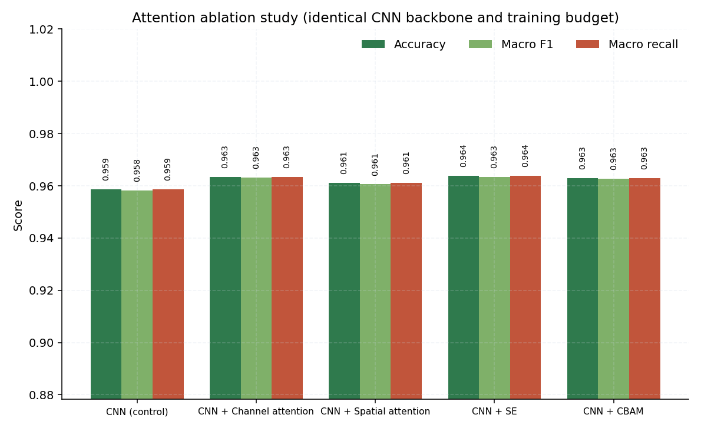

<!-- GENERATED FILE - do not edit by hand.
     Produced by scripts/generate_docs.py from artifacts/results/experiments.json.
     Re-run that script after any training sweep. -->

# Ablation study

_Generated 2026-09-01 07:05 UTC._

## Research question

> Does integrating channel and spatial attention through CBAM improve plant disease classification accuracy, robustness and interpretability compared with conventional CNN architectures?

## Design

Five arms share **one** backbone, **one** training budget, **one** data subset and **one** seed. Only the attention block differs, which is what makes this an ablation rather than five unrelated experiments.

| Arm | Attention block | Answers |
|---|---|---|
| A | none | Control |
| B | CBAM channel branch | Does *what to look at* help on its own? |
| C | CBAM spatial branch | Does *where to look* help on its own? |
| D | Squeeze-and-Excitation | Is CBAM's extra max-pooling path worth it over SE? |
| E | Full CBAM | Do the two branches compose? |

## Results

| Arm | Configuration | Accuracy | Macro F1 | Macro recall | Δ Macro F1 | Δ Accuracy | Params | ms/img |
|---|---|---:|---:|---:|---:|---:|---:|---:|
| **A** | CNN (control) | 95.88% | 0.9582 | 0.9588 | — | — | 1,248,774 | 1.92 |
| **B** | CNN + Channel attention | 96.34% | 0.9631 | 0.9634 | +0.49 pt | +0.46 pt | 1,259,782 | 4.22 |
| **C** | CNN + Spatial attention | 96.12% | 0.9606 | 0.9612 | +0.24 pt | +0.24 pt | 1,249,166 | 3.25 |
| **D** | CNN + SE | 96.38% | 0.9634 | 0.9638 | +0.51 pt | +0.50 pt | 1,259,782 | 5.37 |
| **E** | CNN + CBAM | 96.29% | 0.9628 | 0.9629 | +0.45 pt | +0.42 pt | 1,260,174 | 6.66 |

## Measured noise floor

Before reading any delta it is worth knowing how large a difference this setup produces by chance. Two separate floors are measured, and they are not interchangeable.

### Floor 1 - repeating the same configuration

3 configuration(s) here were trained more than once by construction - same architecture, same hyperparameters, same seed, differing only in which suite ran them. The spread within each group is how far apart repeated runs of the same thing land.

| Repeated configuration | Runs | Accuracy | Macro F1 | Macro F1 spread |
|---|---:|---|---|---:|
| `cnn_baseline`, `abl_cnn_none` | 2 | 95.83% to 95.88% | 0.9578 to 0.9582 | 0.04 pt |
| `cnn_se`, `abl_cnn_se` | 2 | 96.03% to 96.38% | 0.9598 to 0.9634 | 0.35 pt |
| `cnn_cbam`, `abl_cnn_cbam`, `place_cbam_all` | 3 | 96.07% to 96.54% | 0.9605 to 0.9652 | 0.47 pt |

What differs between repeated runs of one configuration:

* DataLoader worker count (0 vs 2), and so the per-worker augmentation seeds and batch composition
* DataLoader worker count (2 vs 4), and so the per-worker augmentation seeds and batch composition
* GPU reduction order
* cuDNN algorithm selection

The two pairs disagreed by 0.04 pt and 0.47 pt respectively - close to an order of magnitude apart. The larger is used, because a single close-agreeing pair would badly understate how far apart two runs of one configuration can land.

This floor is still a **lower bound**, not a significance threshold. It holds the initialisation fixed, whereas the arms being compared do not: CBAM and the plain CNN have different parameter shapes, so they consume the random stream differently and start from different weights even at the same seed. A gap between two architectures therefore carries initialisation variance that this measurement excludes by construction.

### Floor 2 - seed variation (measured, but narrower than Floor 1)

`cnn_baseline` retrained at 3 seeds. Everything that differs between two architectures now varies - weight initialisation, augmentation draws, batch composition - except the architecture itself.

| Seed | Accuracy | Macro F1 |
|---|---|---:|
| 42 | 95.83% | 0.9578 |
| 43 | 95.61% | 0.9556 |
| 44 | 95.75% | 0.9570 |

Mean macro F1 0.9568, SD 0.11 pt, range 0.22 pt.

**Retraining cnn_baseline at 3 seeds moved macro F1 across 0.22 points (SD 0.11). Repeating identical configurations moved it further still, by up to 0.47 points, so 0.47 points is used as the threshold: it is the largest variation observed between runs that should have been equivalent. A gap between attention arms smaller than this is not evidence of an architectural effect.**

## Verdict

CBAM improved macro F1 by 0.45 points, which is within the 0.47-point run-to-run variation measured on this setup. The improvement is directionally positive but not established.

| Measure | Value |
|---|---:|
| CBAM Δ macro F1 vs control | +0.45 pt |
| CBAM Δ accuracy vs control | +0.42 pt |
| CBAM inference overhead | +246.6% |
| CBAM parameter overhead | +0.91% |
| Best-performing arm | CNN + SE (macro F1 0.9634) |
| Is CBAM the best arm? | no |

> **Caveat.** All five arms share one architecture, one training budget, one data subset and one seed; only the attention block differs. A single run per arm cannot establish statistical significance. Retraining cnn_baseline at 3 seeds moved macro F1 across 0.22 points (SD 0.11). Repeating identical configurations moved it further still, by up to 0.47 points, so 0.47 points is used as the threshold: it is the largest variation observed between runs that should have been equivalent. A gap between attention arms smaller than this is not evidence of an architectural effect.

## A second test: CBAM on pretrained backbones

The five-arm ablation answers the research question for one from-scratch CNN. The benchmark independently contains **matched pairs** - the same ImageNet backbone with and without a CBAM block on its final feature map, trained under the identical protocol. Those pairs test the same question in a different regime, and are worth reading precisely because a pretrained trunk has already learned to suppress irrelevant features, so there may be less for attention to add.

| Backbone | Macro F1 without | Macro F1 with | Delta | Params | Latency |
|---|---:|---:|---:|---:|---:|
| EfficientNet-B0 | 0.9700 | 0.9681 | -0.20 pt * | +5.1% | -8.3% |
| ResNet50 | 0.9912 | 0.9914 | +0.02 pt * | +2.2% | +12.2% |
| MobileNetV3-Large | 0.9497 | 0.9473 | -0.25 pt * | +3.8% | +4.4% |

**Reading:** Across 3 matched backbone pair(s), every CBAM/no-CBAM difference is smaller than the 0.47-point run-to-run variation measured on this setup. On pretrained backbones at this scale, the evidence neither supports nor refutes a CBAM benefit.

`*` marks a difference smaller than the measured 0.47-point run-to-run variation, which a single run each cannot separate from noise.

> One run per configuration. These pairs are a secondary line of evidence alongside the controlled five-arm ablation, not a replacement for it - the ablation holds the backbone fixed, whereas each pair here changes only where CBAM is inserted in an already pretrained network.

## CBAM placement

The five arms above vary *which* attention mechanism is used, applying it at every stage. This varies the other axis: the same CBAM block, inserted at a different depth. It is a separate question, and on this dataset it produced the larger effect.

| Placement | Stages | Accuracy | Macro F1 | Δ vs control | Beyond noise | Params | ms/img |
|---|---:|---:|---:|---:|:---:|---:|---:|
| Last stage only | 1 | 95.75% | 0.9569 | -0.13 pt | no | 1,257,064 | 3.60 |
| Last two stages | 2 | 96.78% | 0.9676 | +0.94 pt | yes | 1,259,210 | 5.70 |
| Every stage | 4 | 96.54% | 0.9652 | +0.70 pt | yes | 1,260,174 | 4.58 |

Control (`abl_cnn_none`, no attention): 0.9582 macro F1.

**Attention on the last two stages scored highest (0.9676 macro F1, +0.94 pt against the identical network without attention). The spread between the best and worst placement is 1.07 pt, larger than the 0.47-pt run-to-run floor. The worst placement is 0.13 pt *below* the no-attention control, so the same block can help or hurt depending only on where it is inserted.**

#### Does it survive full-data training?

At full data scale the same contrast holds: CBAM on the last two stages reaches 0.9880 macro F1 against 0.9842 for CBAM on every stage, a +0.38 pt difference at an identical parameter count. The fixed-budget study and the full-data runs therefore agree on direction, which a single measurement could not establish.

| Placement | Macro F1 | Accuracy | Params |
|---|---:|---:|---:|
| Every stage (`cnn_cbam`) | 0.9842 | 98.42% | 1,260,174 |
| Last two stages (`place_cbam_last2`) | 0.9880 | 98.81% | 1,259,210 |

> One run per placement. The spread is compared against the measured run-to-run floor, which is a lower bound rather than a significance test, so this identifies where to look next rather than settling the question.
