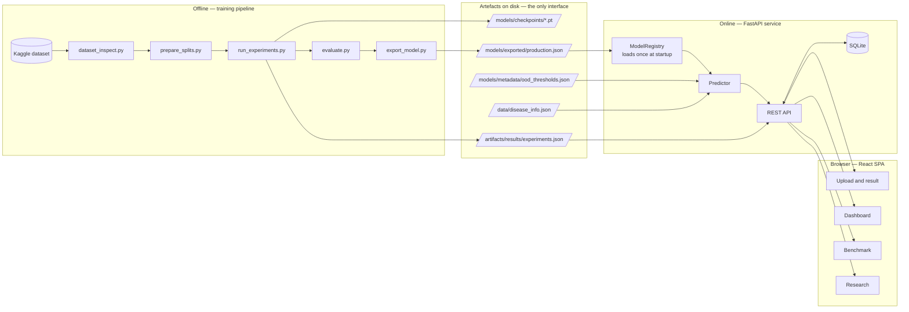
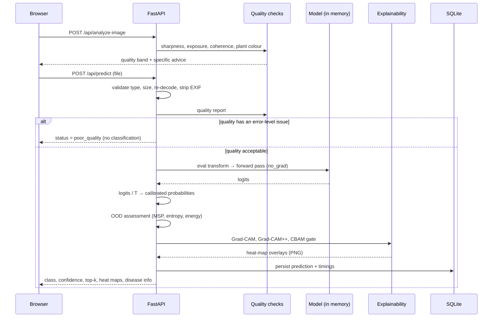
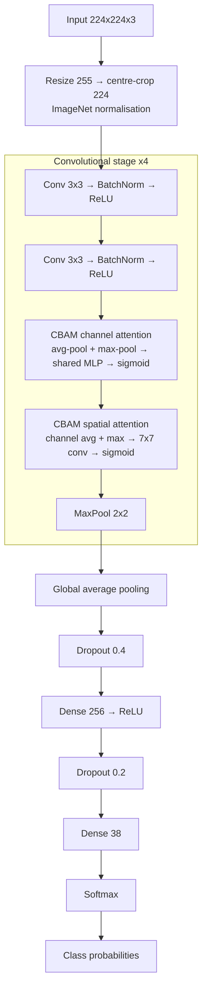
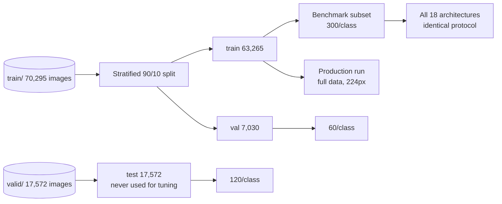

# System architecture

## Overview

The project is four separable pieces with narrow interfaces between them. The
important boundary is between **training** and **serving**: they share model
code but nothing else, and they communicate only through files on disk.



**Why this boundary matters.** The FastAPI process cannot train, cannot read the
dataset, and cannot compute a metric. It reads a checkpoint and some JSON. That
means a model can be retrained and promoted without touching application code,
and it means no reported number can drift from the experiment that produced it.

## Request path for one prediction



## Layer responsibilities

| Layer | Location | Responsibility | Must not |
|---|---|---|---|
| Model code | `backend/app/ml/` | Architectures, attention, transforms, explainability, OOD, quality, features | Touch HTTP or the database |
| Training | `training/` | Data prep, training loop, evaluation, calibration, export | Be imported by the API |
| Services | `backend/app/services/` | Predictor, knowledge base, artefact reading | Contain HTTP details |
| API | `backend/app/api/routes/` | Request validation, serialisation, status codes | Contain ML logic |
| Frontend | `frontend/src/` | Presentation, interaction | Compute metrics |

`backend/app/ml/` being shared by both training and serving is deliberate and
load-bearing: it is what guarantees an image is preprocessed at inference
exactly as it was during training. A duplicated transform is one of the most
common silent accuracy killers in deployed vision systems.

## The proposed model



CBAM sits **after** the activated, batch-normalised feature map and **before**
down-sampling, which is where it has the most spatial detail to work with. The
`attention_stages` parameter controls which stages get a block; the placement
experiment measures whether all four, the last two, or only the last is best.

For transfer-learning variants the structure is the same idea applied once, at
the top of the pretrained trunk:

```
ImageNet backbone (frozen, then partially unfrozen)
  → [optional CBAM]
  → global average pooling
  → dropout
  → linear(num_classes)
```

## Data flow at training time



Manifests (`data/manifests/*.csv`) are materialised once so every script — the
classical baselines, the deep benchmark, the ablation — reads the same rows in
the same order. Nothing re-shuffles the data.

## Technology choices and their reasons

| Choice | Reason |
|---|---|
| PyTorch over TensorFlow | TensorFlow has no GPU support on Windows for Python 3.13 (native-Windows GPU builds stopped at TF 2.10 / Python 3.10). PyTorch CUDA works and was verified on the target GTX 1650. |
| FastAPI | Automatic OpenAPI, Pydantic validation at the boundary, async file uploads. |
| SQLite + SQLAlchemy | Zero-configuration for a single-node deployment; the ORM makes the swap to PostgreSQL a URL change. |
| Manifest CSVs over `ImageFolder` | Guarantees every experiment sees identical splits. |
| JSON ledger over MLflow | Runs from a clean clone with no server to start, and the API reads it directly. |
| React + Vite + Tailwind | Fast HMR, small bundle, no CSS naming overhead. |
| Recharts | Declarative, composes with React state, no imperative canvas layer. |

## Failure modes handled explicitly

| Failure | Handling |
|---|---|
| No model exported | API starts, `/api/predict` returns 503 with instructions; dashboard/docs still work |
| Corrupt image in a batch | Dataset substitutes the next readable sample and records the path; count reported after training |
| CUDA out of memory | Batch size halved and the run retried once |
| DataLoader workers cannot start | Detected and retried with in-process loading |
| Half precision slower than full | Measured at startup; AMP disabled when the measured speed-up is below 1.15x |
| Model file missing at load | Registry raises with the exact path; health endpoint reports it |
| Malformed experiment ledger | Moved aside and recreated rather than blocking a rerun |
