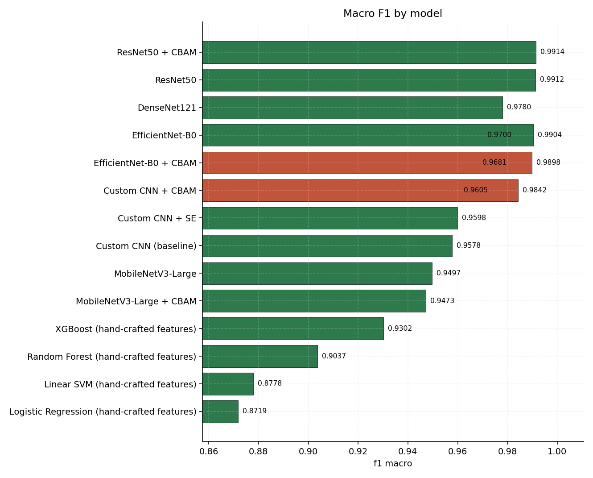
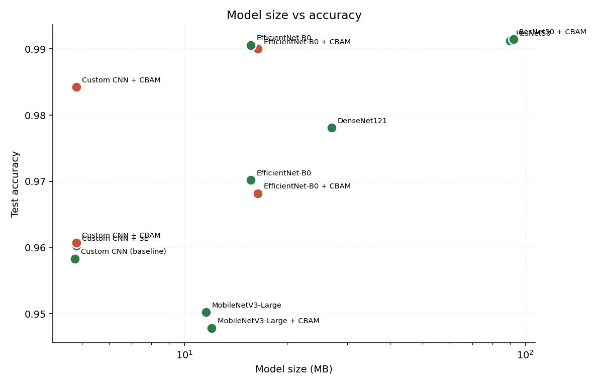
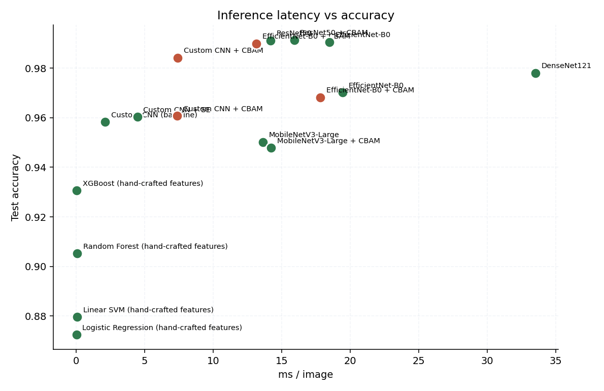

<!-- GENERATED FILE - do not edit by hand.
     Produced by scripts/generate_docs.py from artifacts/results/experiments.json.
     Re-run that script after any training sweep. -->

# Model comparison

_Generated 2026-09-01 07:05 UTC._

## Full metric table

| | Model | Protocol | Accuracy | Precision | Recall | Macro F1 | Top-3 | Params | Size | ms/img | ECE |
|---|---|---|---|---:|---:|---:|---:|---:|---:|---:|---:|
|  | ResNet50 + CBAM | benchmark | 99.14% | 0.9917 | 0.9914 | 0.9914 | 99.96% | 24.11M | 92.2 MB | 15.93 | 0.0612 |
|  | ResNet50 | benchmark | 99.12% | 0.9914 | 0.9912 | 0.9912 | 99.93% | 23.59M | 90.2 MB | 14.19 | 0.0614 |
|  | EfficientNet-B0 | production | 99.06% | 0.9906 | 0.9904 | 0.9904 | 99.94% | 4.06M | 15.6 MB | 18.50 | 0.0500 |
| **★** | EfficientNet-B0 + CBAM | production | 99.00% | 0.9900 | 0.9898 | 0.9898 | 99.94% | 4.26M | 16.4 MB | 13.17 | 0.0500 |
| **★** | Custom CNN + CBAM | production | 98.42% | 0.9845 | 0.9842 | 0.9842 | 99.90% | 1.26M | 4.8 MB | 7.41 | 0.0245 |
|  | DenseNet121 | benchmark | 97.81% | 0.9781 | 0.9781 | 0.9780 | 99.78% | 6.99M | 27.0 MB | 33.52 | 0.0617 |
|  | EfficientNet-B0 | benchmark | 97.02% | 0.9707 | 0.9702 | 0.9700 | 99.65% | 4.06M | 15.6 MB | 19.47 | 0.0721 |
| **★** | EfficientNet-B0 + CBAM | benchmark | 96.82% | 0.9688 | 0.9682 | 0.9681 | 99.63% | 4.26M | 16.4 MB | 17.84 | 0.0727 |
| **★** | Custom CNN + CBAM | benchmark | 96.07% | 0.9612 | 0.9607 | 0.9605 | 99.58% | 1.26M | 4.8 MB | 7.39 | 0.0418 |
|  | Custom CNN + SE | benchmark | 96.03% | 0.9609 | 0.9603 | 0.9598 | 99.54% | 1.26M | 4.8 MB | 4.47 | 0.0626 |
|  | Custom CNN (baseline) | benchmark | 95.83% | 0.9586 | 0.9583 | 0.9578 | 99.50% | 1.25M | 4.8 MB | 2.13 | 0.0670 |
|  | MobileNetV3-Large | benchmark | 95.02% | 0.9507 | 0.9502 | 0.9497 | 99.25% | 3.01M | 11.6 MB | 13.64 | 0.0957 |
|  | MobileNetV3-Large + CBAM | benchmark | 94.78% | 0.9480 | 0.9478 | 0.9473 | 99.14% | 3.12M | 12.0 MB | 14.24 | 0.0901 |
|  | XGBoost (hand-crafted features) | classical | 93.07% | 0.9309 | 0.9307 | 0.9302 | 98.86% | — | — | 0.05 | — |
|  | Random Forest (hand-crafted features) | classical | 90.53% | 0.9068 | 0.9053 | 0.9037 | 97.65% | — | — | 0.09 | — |
|  | Linear SVM (hand-crafted features) | classical | 87.96% | 0.8785 | 0.8796 | 0.8778 | 96.01% | — | — | 0.09 | — |
|  | Logistic Regression (hand-crafted features) | classical | 87.24% | 0.8726 | 0.8724 | 0.8719 | 97.15% | — | — | 0.02 | — |

## Extended metrics

| Model | Weighted F1 | Top-5 | ROC-AUC (OvR) | Cohen's κ | Val accuracy | Best epoch | Train time |
|---|---:|---:|---:|---:|---:|---:|---:|
| ResNet50 + CBAM | 0.9914 | 99.98% | 1.0000 | 0.9912 | 98.95% | 11 | 16.8 min |
| ResNet50 | 0.9912 | 99.96% | 1.0000 | 0.9910 | 99.04% | 11 | 19.6 min |
| EfficientNet-B0 | 0.9905 | 99.98% | 1.0000 | 0.9903 | 99.19% | 6 | 57.7 min |
| EfficientNet-B0 + CBAM | 0.9899 | 99.98% | 1.0000 | 0.9897 | 99.09% | 6 | 63.0 min |
| Custom CNN + CBAM | 0.9842 | 99.98% | 0.9999 | 0.9838 | 98.58% | 6 | 104.5 min |
| DenseNet121 | 0.9780 | 99.98% | 0.9998 | 0.9775 | 98.07% | 12 | 11.3 min |
| EfficientNet-B0 | 0.9700 | 99.82% | 0.9997 | 0.9694 | 97.06% | 9 | 8.3 min |
| EfficientNet-B0 + CBAM | 0.9681 | 99.87% | 0.9997 | 0.9673 | 96.97% | 9 | 10.2 min |
| Custom CNN + CBAM | 0.9605 | 99.87% | 0.9997 | 0.9597 | 96.27% | 11 | 16.9 min |
| Custom CNN + SE | 0.9598 | 99.85% | 0.9997 | 0.9592 | 96.05% | 11 | 12.5 min |
| Custom CNN (baseline) | 0.9578 | 99.76% | 0.9996 | 0.9572 | 95.61% | 11 | 10.8 min |
| MobileNetV3-Large | 0.9497 | 99.76% | 0.9993 | 0.9489 | 95.48% | 10 | 6.2 min |
| MobileNetV3-Large + CBAM | 0.9473 | 99.69% | 0.9993 | 0.9464 | 95.61% | 12 | 7.9 min |
| XGBoost (hand-crafted features) | 0.9302 | 99.56% | 0.9988 | 0.9288 | — | — | 14.9 min |
| Random Forest (hand-crafted features) | 0.9037 | 98.75% | 0.9968 | 0.9027 | — | — | 1.3 min |
| Linear SVM (hand-crafted features) | 0.8778 | 98.38% | 0.9937 | 0.8764 | — | — | 81.4 min |
| Logistic Regression (hand-crafted features) | 0.8719 | 98.55% | 0.9960 | 0.8689 | — | — | 0.3 min |

## Production selection

**Serving:** EfficientNet-B0 (`efficientnet_b0`)

**Criterion:** `f1_macro` — Highest macro F1 on the held-out test split - treats every disease class equally regardless of how many images it has.

> The production model is chosen on measured test performance. The proposed CBAM architecture remains the research contribution and is reported in the benchmark and ablation tables regardless of whether it wins this selection.

| Criterion | Winner |
|---|---|
| `f1_macro` | efficientnet_b0 |
| `accuracy` | efficientnet_b0 |
| `balanced` | place_cbam_last2 |
| `fastest` | place_cbam_last2 |
| `smallest` | place_cbam_last2 |

## Charts

| | |
|---|---|
|  |  |
|  |  |
|  |  |
