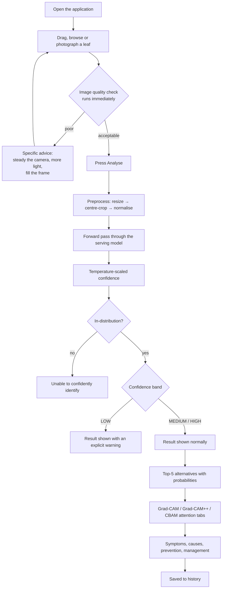
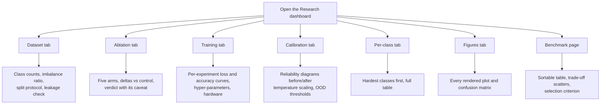

# Project flow

Two journeys through the system, and the pipeline that makes them possible.

---

## User journey

**What the user sees at each step**

| Step | Screen element |
|---|---|
| Upload | Drag-and-drop zone, file browser, camera capture on mobile |
| Quality | Coloured banner: good / acceptable / poor, with specific fixes |
| Analysing | Scanning-line animation over the preview |
| Result | Plant, condition, confidence bar, HIGH/MEDIUM/LOW chip |
| Alternatives | Ranked top-5 with probability bars |
| Reliability | Three explicit checks: quality, in-distribution, confidence |
| Explainability | Tabbed heat maps with a "how to read this" caveat |
| Knowledge | Symptoms, spread, favourable conditions, prevention, management |
| Provenance | Model name, inference time, image-quality score |

---

## Researcher journey

---

## The pipeline, end to end

```mermaid
flowchart LR
    subgraph P1["1 · Acquire"]
        D1[scripts/download_dataset.py]
    end
    subgraph P2["2 · Understand"]
        D2[training/dataset_inspect.py]
        D2b[artifacts/dataset_report.json]
        D2 --> D2b
    end
    subgraph P3["3 · Split"]
        D3[training/prepare_splits.py]
        D3b[data/manifests/*.csv<br/>data/splits.json]
        D3 --> D3b
    end
    subgraph P4["4 · Baseline"]
        D4[training/train_classical.py]
    end
    subgraph P5["5 · Train"]
        D5[training/run_experiments.py<br/>--suite research]
    end
    subgraph P6["6 · Analyse"]
        D6[training/analyse_results.py]
    end
    subgraph P7["7 · Select & calibrate"]
        D7[training/export_model.py]
        D8[training/calibrate_ood.py]
    end
    subgraph P8["8 · Document"]
        D9[scripts/generate_docs.py]
    end
    subgraph P9["9 · Serve"]
        D10[uvicorn app.main:app]
        D11[npm run dev]
    end

    P1 --> P2 --> P3 --> P4 --> P5 --> P6 --> P7 --> P8 --> P9
```

### What each stage produces

| Stage | Command | Writes |
|---|---|---|
| 0 Probe | `python scripts/probe_hardware.py` | `artifacts/results/hardware_probe.json` |
| 1 Acquire | `python scripts/download_dataset.py` | `data/dataset_path.json` |
| 2 Understand | `python training/dataset_inspect.py` | `artifacts/dataset_report.json` |
| 3 Split | `python training/prepare_splits.py` | `data/manifests/*.csv`, `data/splits.json`, dataset plots |
| — Knowledge | `python scripts/build_disease_info.py` | `data/disease_info.json` |
| 4 Baseline | `python training/train_classical.py` | `artifacts/results/classical_results.json`, cached features |
| 5 Train | `python training/run_experiments.py --suite research` | checkpoints, `experiments.json`, curves, confusion matrices |
| 6 Analyse | `python training/analyse_results.py` | comparison charts, `ablation_summary.json`, `summary.json` |
| 7a Select | `python training/export_model.py --criterion f1_macro` | `models/exported/production.json` |
| 7b Calibrate | `python training/calibrate_ood.py` | `models/metadata/ood_thresholds.json` |
| 7c Measure | `python scripts/benchmark_serving.py` | `artifacts/results/serving_benchmark.json` |
| 8 Document | `python scripts/generate_docs.py` | `docs/results.md`, `docs/model_comparison.md`, `docs/ablation_study.md`, README results block |
| 9 Serve | `uvicorn` + `npm run dev` | — |

Every stage is idempotent and resumable. Re-running the training suite skips
configurations already in the ledger, so an interrupted sweep continues where it
stopped — and `scripts/supervise_training.py` automates exactly that, relaunching
the sweep if the process is killed and stopping when every expected model has a
test-scored record.

---

## Where each requirement is implemented

| Requirement | Implementation |
|---|---|
| Dataset discovery without assumptions | `training/dataset_inspect.py` |
| Duplicate / leakage detection | `duplicate_analysis()` (pHash) |
| Stratified three-way split | `app/ml/datasets.py`, `training/prepare_splits.py` |
| Class-imbalance decision | `choose_imbalance_strategy()` |
| Augmentation policy | `app/ml/transforms.py` |
| Classical ML baselines | `app/ml/features.py`, `training/train_classical.py` |
| Custom CNN, SE, CBAM | `app/ml/attention.py`, `app/ml/architectures.py` |
| Transfer-learning backbones | `TransferModel`, `BACKBONES` |
| Two-stage fine-tuning | `trainer.train_model()` stage transition |
| Ablation study | `MODEL_ZOO` group `ablation`, `analyse_results.build_ablation_summary()` |
| CBAM placement study | `MODEL_ZOO` group `placement` |
| Hyper-parameter search | `training/tune_hyperparameters.py` |
| Metrics and plots | `training/metrics.py`, `training/evaluate.py` |
| Calibration | `fit_temperature()`, `calibration_report()` |
| OOD detection | `app/ml/ood.py`, `training/calibrate_ood.py` |
| Image quality checks | `app/ml/quality.py` |
| Explainability | `app/ml/explain.py` |
| Knowledge base | `scripts/build_disease_info.py` → `data/disease_info.json` |
| Experiment tracking | `training/tracker.py` |
| Smart model selection | `training/export_model.py` |
| Model serving (load once) | `app/ml/registry.py`, `app/main.py` lifespan |
| Prediction history | `app/models/prediction.py`, `app/api/routes/predictions.py` |
| REST API + OpenAPI | `app/api/routes/`, `/docs` |
| Upload security | `app/utils/images.py` |
| Structured logging | `app/core/logging.py` |
| Configuration | `app/core/config.py`, `.env.example` |
| Frontend | `frontend/src/` |
| Tests | `tests/test_api.py`, `tests/test_ml.py` |
| Deployment | `docker/`, `docker-compose.yml` |
| Hardware-adaptive config | `training/config.py`, `scripts/probe_hardware.py` |
| Serving performance metrics | `scripts/benchmark_serving.py`, `/api/metrics/performance` |
| Portable model export | `export_model.py --torchscript --onnx` |
